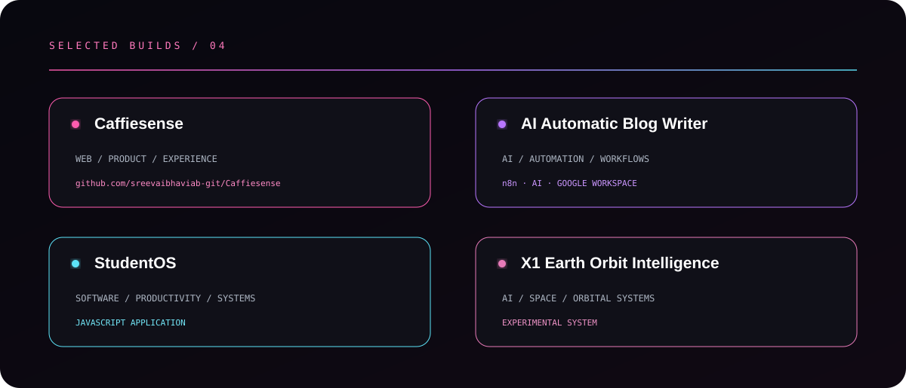
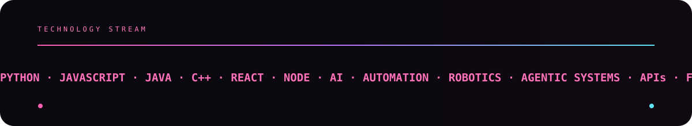

  

&nbsp;

&nbsp;

  

 

 

 

<picture>
<source media="(prefers-color-scheme: dark)"
srcset="https://raw.githubusercontent.com/sreevaibhaviab-git/sreevaibhaviab-git/output/github-contribution-grid-snake-dark.svg">

</picture>

  

